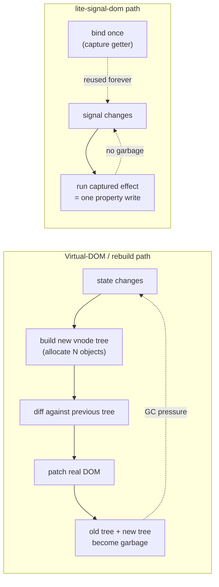
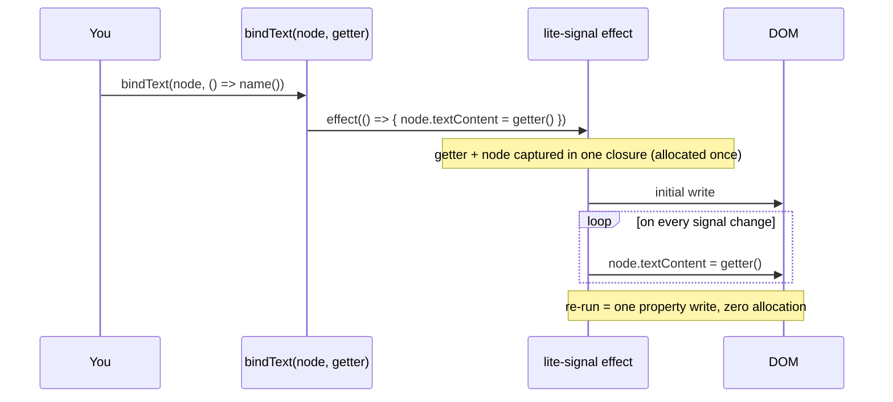
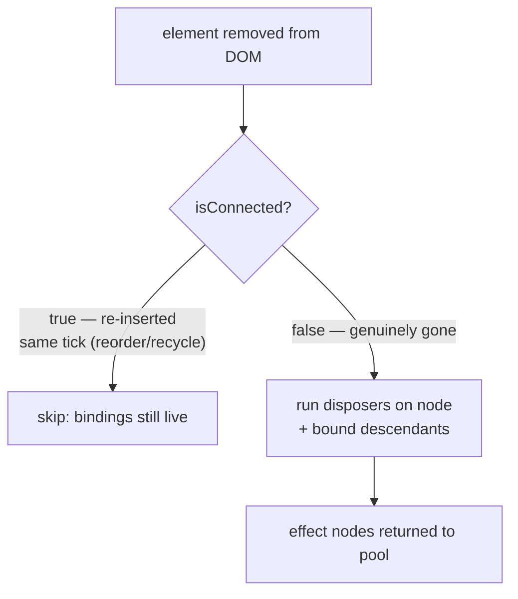
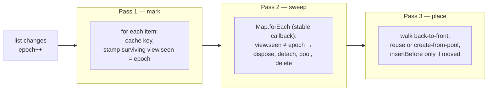

# @zakkster/lite-signal-dom

[](https://www.npmjs.com/package/@zakkster/lite-signal-dom)
[](https://bundlephobia.com/result?p=@zakkster/lite-signal-dom)
[](https://www.npmjs.com/package/@zakkster/lite-signal-dom)


[](https://opensource.org/licenses/MIT)

**Zero-GC, vanilla-first reactive DOM bindings for [`@zakkster/lite-signal`](https://www.npmjs.com/package/@zakkster/lite-signal).**

No virtual DOM. No template compiler. No build step. Each binding is one signal `effect` wrapping a single DOM write — the getter is captured **once** at bind time, so steady-state updates allocate **0 bytes** on the JS heap. A keyed list reconciler diffs by key, reuses surviving elements, and recycles removed ones through a pool.

```js
import { signal } from '@zakkster/lite-signal';
import { bindText, bindClass, bindOn, keyed } from '@zakkster/lite-signal-dom';

const count = signal(0);

bindText(label, () => `count: ${count()}`);          // textContent follows the signal
bindClass(label, 'is-zero', () => count() === 0);    // toggle one class, reactively
bindOn(button, 'click', () => count.update(n => n + 1));

// A keyed list — diffed by id, elements reused across reorders:
const rows = signal([{ id: 1, text: signal('first') }]);
keyed(listEl, rows, r => r.id, (r, recycled) => {
  const li = recycled || document.createElement('li');   // reuse a pooled <li> if offered
  return { element: li, dispose: bindText(li, () => r.text()) };
});
```

Everything above updates the real DOM with no diffing pass, no re-render of unrelated nodes, and no per-update allocation.

---

## Contents

- [Why](#why) · [Install](#install) · [Quick start](#quick-start)
- [How it works](#how-it-works)
- [The keyed reconciler](#the-keyed-reconciler)
- [API reference](#api-reference)
- [Benchmarks](#benchmarks)
- [Testing (for clients & QA)](#testing-for-clients--qa)
- [Running the demo](#running-the-demo)
- [Browser & engine compatibility](#browser--engine-compatibility)
- [Edge cases & guarantees](#edge-cases--guarantees)
- [FAQ](#faq) · [License](#license)

---

## Why

Reactive UI libraries usually pay for ergonomics with **per-update allocation**. A virtual-DOM render builds a fresh tree of vnode objects every time state changes, diffs it against the last one, then throws both away. A naive hand-rolled reactive list rebuilds its child elements on every change. Both produce a steady drip of garbage that the collector has to chase — and on a 60 fps budget (16.6 ms/frame), a GC pause is a dropped frame.



`@zakkster/lite-signal-dom` skips the whole tree-diff model. A binding is a direct, standing subscription from one signal to one spot in the DOM. When the signal changes, exactly that spot updates — nothing is rebuilt, nothing is compared, nothing is allocated.

### What this is *not*

- **Not a framework.** No components, no router, no JSX, no lifecycle. You own the DOM; this wires signals into it.
- **Not a virtual DOM.** There is no diffing of trees. The only diff is the keyed-list reconciler, and it diffs *keys*, not DOM.
- **Not magic.** For a single static node, `el.textContent = x` by hand is obviously cheaper. This library earns its keep when state is dynamic, bindings are many, and lists churn — where it gives you reactive ergonomics at hand-written allocation cost.

---

## Install

```bash
npm i @zakkster/lite-signal-dom
```

ESM-only. One runtime dependency (`@zakkster/lite-signal`). Ships TypeScript definitions alongside the source.

```js
import { bindText, keyed } from '@zakkster/lite-signal-dom';
```

You can also drop `SignalDom.js` into your project directly — it's one file with one import.

---

## Quick start

```js
import { signal, computed } from '@zakkster/lite-signal';
import {
  bindText, bindAttr, bindProp, bindClass, bindStyle, bindShow, bindOn, keyed,
} from '@zakkster/lite-signal-dom';

const name  = signal('world');
const ready = signal(false);

bindText(document.querySelector('h1'), () => `hello ${name()}`);
bindShow(document.querySelector('#spinner'), () => !ready());
bindAttr(document.querySelector('button'), 'disabled', () => !ready());
bindClass(document.querySelector('.dot'), 'live', () => ready());

bindOn(document.querySelector('button'), 'click', () => ready.set(true));
```

Each call returns an idempotent disposer if you want deterministic teardown:

```js
const stop = bindText(el, () => name());
// ...later
stop(); // unsubscribes; calling again is a safe no-op
```

If you don't keep the disposer, the binding is cleaned up automatically when the element leaves the DOM (see [How it works](#how-it-works)).

---

## How it works

### A binding is a captured effect

Every `bind*` call does the same three things, once:



The closure that does the work is created a single time, at bind time. Re-running it on a signal change is a single indexed property write. lite-signal's effect node itself is pool-backed, so even the reactive bookkeeping doesn't allocate. The result: a bound update costs what the equivalent hand-written assignment costs, plus a pooled function call.

### Automatic disposal

A single document-level `MutationObserver` watches for removed nodes. When a bound element (or any bound descendant of a removed subtree) leaves the DOM, its bindings are torn down and lite-signal's effect nodes return to the pool — no manual cleanup, no leak.



The `isConnected` check is the subtle part. A `keyed` reorder, or a pooled-element recycle, detaches and reattaches a node within the same task. The observer's callback runs later, on a microtask — by which point the node is connected again and its (possibly brand-new) bindings are live. Tearing them down then would silently freeze a still-mounted element. The guard prevents exactly that.

---

## The keyed reconciler

`keyed()` is the reactive analogue of an **ECS entity table**. It reacts to a signal returning an array, and on every change reconciles the mounted elements against the new list **by key** — reusing the element for any key that survives, and recycling removed elements through an internal pool so your `renderFn` can reset one instead of allocating a new node.

```js
const items = signal([{ id: 1, label: signal('a') }]);

keyed(
  containerEl,
  items,                       // reactive source → the array
  item => item.id,             // stable, unique key
  (item, recycled) => {        // build a row, or reset a recycled one
    const li = recycled || document.createElement('li');
    const stop = bindText(li, () => item.label());
    return { element: li, dispose: stop };
  },
);

items.set([{ id: 2, label: signal('b') }, { id: 1, label: signal('a') }]); // diffed by id
```

### The diff: a three-pass epoch mark-sweep

The reconciler holds three persistent structures, all allocated **once** at registration: a `Map` of active views, an element pool, and a reusable key-scratch array. Each update bumps an integer `epoch` and runs three linear passes — **no `Set`, no temporary key array, no iterator objects** are created per update.



Surviving keys keep their exact DOM element (and its bindings). Removed elements are pooled and handed back to `renderFn` as `recycled`. New keys either reuse a pooled element or get `null` and create one. Reorders are pure `insertBefore` moves, applied only where the order actually changed.

Because `renderFn`'s reads are **untracked**, the list effect re-runs only when the *list itself* changes. Fine-grained updates inside a row (its text, its classes) come from the bindings `renderFn` set up, which react independently — so editing one row never re-runs the reconciler.

---

## API reference

Every getter is `() => value`. Every binder returns an **idempotent** `Dispose = () => void`.

### Bindings

| Function | Effect | Notes |
|---|---|---|
| `bindText(node, getter)` | `node.textContent = getter()` | Safe for untrusted content. Coerced to string. |
| `bindHTMLUnsafe(node, getter)` | `node.innerHTML = getter()` | ⚠️ Never pass unsanitised input. |
| `bindAttr(node, attr, getter)` | set/remove attribute | `null`/`undefined`/`false` → remove; `true` → `""`; else `String(v)`. |
| `bindProp(node, prop, getter)` | `node[prop] = getter()` | For live properties: `value`, `checked`, `selectedIndex`… |
| `bindClass(node, className, getter)` | toggle one class | Other classes untouched. |
| `bindStyle(node, styleProp, getter)` | `node.style[prop] = …` | `null`/`undefined` resets to `""`. |
| `bindShow(node, getter, displayStyle?)` | `style.display` | shown → `displayStyle` (default `""`), hidden → `"none"`. |
| `bindOn(node, event, handler, options?)` | `addEventListener` | Lifetime tied to the DOM. Touch/wheel default to `{ passive: true }`. |

### `keyed(parent, listGetter, keyFn, renderFn) → Dispose`

| Arg | Type | Description |
|---|---|---|
| `parent` | `Element` | Container element. |
| `listGetter` | `() => T[]` | Reactive read returning the list. |
| `keyFn` | `(item: T) => string \| number` | Stable, unique-per-render key. |
| `renderFn` | `(item: T, recycled: Element \| null) => KeyedView` | Build a new element, or reset the recycled one. |

`KeyedView` = `{ element: Element, dispose: () => void }`. The returned disposer tears the whole list down: every view, every element, and the internal anchor comment.

---

## Benchmarks

> **Read this first.** There are two kinds of number here, measured very differently.
>
> - **Allocation** is the headline. It's measured against a **no-op linked-list DOM** (`mock-dom.js`), not jsdom — deliberately. That isolates *the library's own* per-update allocation from the host DOM's: moving a node in a real browser is native and allocates no JS heap, whereas jsdom is JS and allocates heavily, and its `MutationObserver` queues a record per mutation that never drains in a tight loop (it would OOM the process and swamp the signal). The mock has zero-allocation O(1) node ops, so a heap delta there is the reconcile/bind bookkeeping plus lite-signal's pooled effect re-run — nothing else.
> - **Throughput** is *algorithmic*: the cost of the reconcile + bind work with no layout, reflow, or paint. It is not a full-browser frame time. The keyed-vs-naive ratio is meaningful; the absolute ops/s are a ceiling.

Run them yourself: `npm run bench` (needs `--expose-gc`, wired into the script). Numbers below are the median of 3 runs on Node 22.

### Allocation — the claim this library lives on

| Workload | Updates | Heap Δ (after GC) | Per update |
|---|---:|---:|---:|
| `bindText` steady-state | 1,000,000 | ~3–16 KB | **< 0.02 bytes** |
| `keyed` reorder (64 items, in place) | 100,000 | ~0.4 KB | **< 0.01 bytes** |

Sub-byte-per-update means there is nothing to allocate and nothing to collect — the few KB over a *million* updates is JIT/GC measurement noise. The getter closures are captured once, the reconciler's `Map`/pool/key-scratch are reused, the diff is an integer mark-sweep (no per-update `Set`, array, or iterator), and elements are pooled rather than re-created. In a browser, the only per-update cost *beyond this* is the DOM mutation itself, which is native.

> **Measuring this yourself.** Reordering by re-setting the *same* array reference only fires the reconciler if the signal is told to skip its equality check: `signal(arr, { equals: false })`. With the default `Object.is`, `list.set(sameArr)` after the first call bails out (nothing changed by reference), so a naive "rotate in place" loop would silently measure nothing. The bench and the allocation tests use `{ equals: false }` precisely so the hot loop reorders *without* cloning the array — otherwise the `.slice()` you'd need would itself allocate every update.

### Throughput — keyed reuse vs naive rebuild (algorithmic)

| Strategy | Allocations per update | Throughput (mock DOM) | Heap Δ |
|---|---|---:|---:|
| `keyed` reorder | **0 elements, 0 closures** | **~300 K ops/s** | ~0 |
| naive full rebuild | 100 elements + 200 closures | ~47 K ops/s | ~0 after GC* |

`keyed` is **~6×** the throughput of a naive rebuild on a no-op DOM. In a real browser the gap is **larger**, not smaller: naive rebuild replaces every node, forcing the engine to drop and reconstruct layout for the whole list each update, while `keyed` only moves existing nodes. \*Naive's net heap delta reads near-zero only because the 300 objects it allocates *per update* are collected between samples — that allocation is real (it happens in every host, browser included) and it's what drives GC stutter under load; the "300 allocs/update" column is the honest figure, not the post-GC byte delta.

### Bundle size

| | Size |
|---|---:|
| Source (one file) | ~20 KB |
| **min + gzip** | **~1.7 KB** |

Zero dependencies beyond `@zakkster/lite-signal`.

---

## Testing (for clients & QA)

Two levels of verification.

### 1. Unit tests — "does it do what it says?"

```bash
npm test
# the allocation tests need GC exposed:
npm run test:gc      # node --expose-gc --test --test-reporter=spec
```

29 deterministic tests across two files. `test/edge-cases.test.js` (functional, under jsdom) covers:

| Group | What's pinned down |
|---|---|
| Every primitive | `bindText` / `bindAttr` (value, boolean, removal) / `bindProp` / `bindClass` / `bindStyle` / `bindShow` / `bindHTMLUnsafe` / `bindOn` — initial value, reactive update, manual + idempotent dispose |
| Auto-disposal | removing a bound element stops its effect; removing a parent tears down bound descendants; effect nodes return to the pool |
| Same-tick re-insert | the `isConnected` guard keeps bindings alive across a detach+reattach in one task |
| `keyed` ordering | initial order, append, prepend, remove, reverse-reorder, stable (no-move) lists |
| `keyed` pooling | removed elements are recycled; **the recycled element keeps its *new* binding live** (the regression that motivated the rewrite) |
| `keyed` correctness | duplicate keys collapse to one view; empty list renders nothing and regrows; `equals:false` in-place reuse propagates |
| `keyed` teardown | dispose removes every view, element and the anchor; idempotent |
| No-leak | 200 mount/unmount cycles return the effect pool exactly to baseline |

`test/zero-alloc.test.js` (isolated, no jsdom, no observer — see [Benchmarks](#benchmarks) for why) asserts the library's own per-update allocation:

| Test | Budget |
|---|---|
| 1,000,000 `bindText` updates | heap grows < 256 KB (measured: ~3–16 KB) |
| 100,000 `keyed` reorders | heap grows < 256 KB (measured: < 1 KB) |
| harness sanity | the reconciler actually reorders the mock DOM |

A clean run prints `pass 29  fail 0` and exits 0. Suitable for CI.

### 2. Benchmark — "does it perform as claimed?"

```bash
npm run bench
```

Prints the allocation + throughput tables above (with live progress) and writes `bench/bench-results.json`. Runs against the mock DOM, so it finishes in seconds and never OOMs. The signal to watch is **bytes/update** — both `bindText` and `keyed` should report a small fraction of a byte. (Exit code is always 0; the numbers are the result.)

### 3. Visual smoke test — "does it feel right?"

```
example/demo.html      # just open it; no build, no server
```

A live keyed board with a running allocation counter — see [Running the demo](#running-the-demo).

---

## Running the demo

```
example/demo.html
```

No build step, no server, no network — the library is bundled inline. Open the file directly.

The demo renders a live, reorderable, filterable keyed list and shows, in real time:

- **elements created vs reused** — proof the pool is working,
- **a churn meter** comparing `keyed` against a naive rebuild of the same list,
- live shuffle / add / remove / filter controls so QA can hammer the reconciler by hand.

It's built to be shown on a projector: open it, mash the **Shuffle 60×** button, and watch the "elements created" counter stay flat while the rows rearrange.

---

## Browser & engine compatibility

Plain ESM using only standard DOM APIs (`MutationObserver`, `classList`, `addEventListener`, `Comment`). Works everywhere ES2017+ does.

| Target | Supported |
|---|---|
| Chrome / Edge 60+ | ✅ |
| Firefox 55+ | ✅ |
| Safari 11+ (iOS 11+) | ✅ |
| Node 18+ (with a DOM, e.g. jsdom) | ✅ |
| Bun / Deno (with a DOM) | ✅ |
| SSR / no-DOM import | ✅ (observer is built only where `MutationObserver` exists, armed lazily on first bind) |

---

## Edge cases & guarantees

Behaviours the test suite pins down:

- **0 bytes allocated per update in steady state**, for both simple bindings and `keyed` reorders. The getter closure is captured once; the reconciler's `Map`, pool, and key-scratch array are allocated once and reused; the diff is an integer mark-sweep with no per-update `Set`/array/iterator.
- **Disposal is idempotent.** Every `bind*` and `keyed` disposer can be called any number of times safely; a disposer that's already run is a no-op.
- **Auto-disposal covers an element and its bound descendants.** A subtree removed in one operation cleans up everything inside it. *Limitation:* a binding placed directly on a **raw text node** that is removed on its own is not auto-collected (the observer keys off elements) — bind on the parent element, or hold the disposer and call it.
- **Same-tick detach + reattach does not dispose.** Reorders and pooled recycles are safe; the `isConnected` guard distinguishes "moved" from "removed."
- **`keyed` keys must be unique per render.** Duplicates collapse to a single view (last position wins), exactly as a `Map` would.
- **`keyed` reuse is by key, not by index.** Reordering keeps each element and its bindings; only `insertBefore` moves happen, and only where order changed.
- **A shrinking list releases its old keys.** The internal key-scratch buffer is truncated to the current length each render, so keys (strings/objects) from a previously longer list are not retained.
- **In-place array reuse needs `equals: false`.** Re-setting the same mutated array reference under the default `Object.is` equality bails out. Use a fresh array, or `signal(arr, { equals: false })` for zero-allocation reorders (see [FAQ](#faq)).
- **A pooled element is reset, not reconstructed.** `renderFn` receives the recycled element so you can clear/re-bind it; if the pool is empty it receives `null`.
- **`renderFn` reads are untracked.** The list effect re-runs only when the list changes; per-row reactivity is independent.
- **Import is side-effect-light and SSR-safe.** No DOM is touched at import time beyond constructing the observer where supported; it observes the document only once the first binding is created.

---

## FAQ

**How is this different from a virtual-DOM library?**
There is no virtual DOM. A binding is a standing subscription from a signal to a specific DOM location; a change runs one property write. There's no vnode tree to build, diff, or discard, so there's no per-update allocation and no reconciliation of unrelated nodes.

**How is it different from SolidJS / its fine-grained peers?**
The reactive model is similar (fine-grained, no VDOM) but the packaging is deliberately minimal: no compiler, no JSX, no components — just functions you call against existing DOM nodes, on top of a pool-backed signal core. It's meant to drop into a canvas/overlay/game project where you already own the DOM and care about GC, not to be an app framework.

**Do I have to dispose bindings manually?**
No. Bindings auto-dispose when their element leaves the DOM. Keep the returned disposer only when you want deterministic teardown before removal, or for a binding on a node you manage outside the normal DOM lifecycle.

**Why a `MutationObserver` instead of disposing on removal myself?**
So that plain DOM manipulation — `el.remove()`, `innerHTML = ''`, a third-party library yanking a node — still cleans up. One observer for the whole document is cheaper than wiring teardown into every removal path, and it can't be bypassed.

**Is the observer a performance problem?**
It only fires on `childList` mutations under `<body>`, and its callback does work proportional to *removed* nodes, not to all mutations. In tight synchronous loops that never yield (benchmarks), mutation records queue up until a microtask drains them — real apps yield every frame, so this never bites. If you're doing millions of synchronous removals, dispose manually.

**Why does `keyed` hand me a recycled element instead of always making a new one?**
That's the whole point — node creation is one of the most expensive DOM operations. Reusing a removed element (after reset) instead of allocating a new one is what keeps reorders and churned lists at zero allocation. You decide how to reset it in `renderFn`.

**Can a row have its own nested reactive content?**
Yes. Inside `renderFn`, set up any bindings you like (including a nested `keyed`). They react on their own and are torn down with the row.

**Does it work with `computed()` and `batch()` from lite-signal?**
Yes. A getter can read computeds; updates wrapped in `batch()` coalesce into a single bound write, exactly as you'd expect.

**My list changes but `keyed` doesn't update — why?**
You're almost certainly mutating an array in place and re-setting the *same reference*: `arr.push(x); list.set(arr)`. lite-signal's default equality is `Object.is`, so `set(sameRef)` sees no change and bails. Two fixes: set a **new** array (`list.set([...arr])` / `list.set(arr.slice())`), or declare the signal with `signal(arr, { equals: false })` so it always propagates. The second avoids the clone and is what the zero-allocation reorder path relies on — re-setting the same mutated array, no garbage.

**TypeScript?**
Ships `SignalDom.d.ts`. `keyed` is generic over the item type; all binders are typed.

---

## License

MIT © Zahary Shinikchiev
